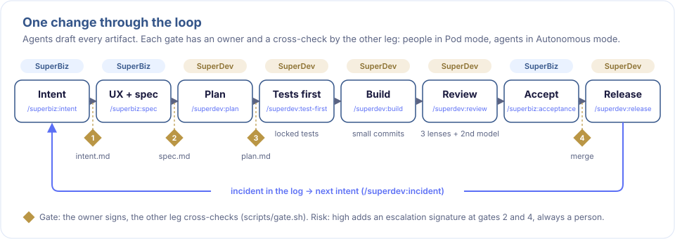
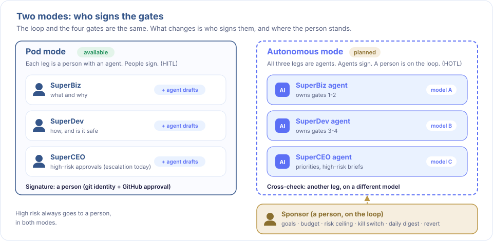
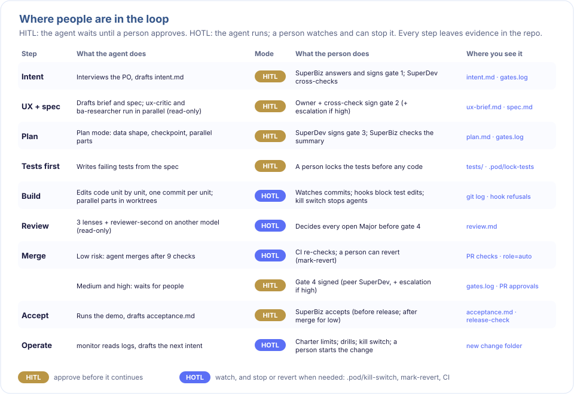
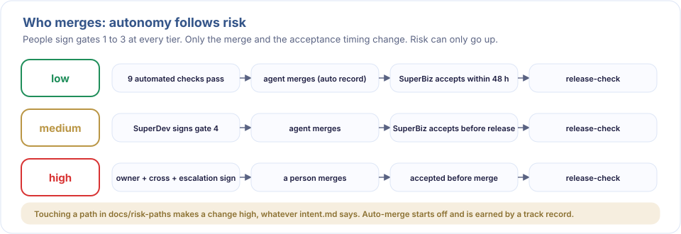
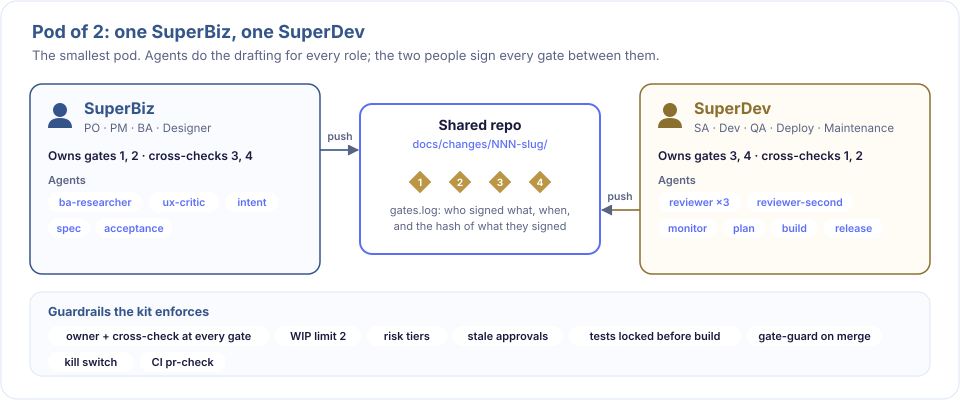
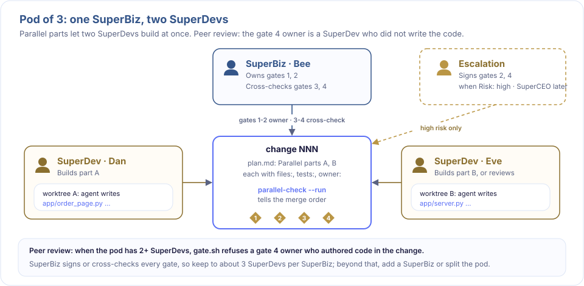
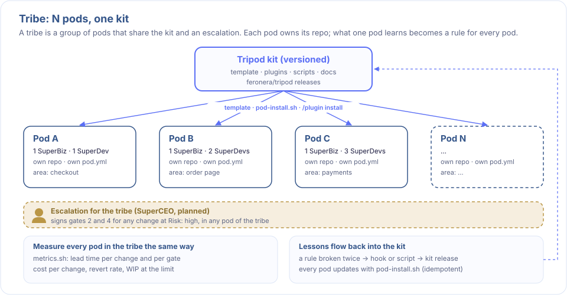

# Tripod

[](LICENSE)
[](https://github.com/feronera/tripod/releases)
[](https://claude.com/claude-code)

**An agentic delivery practice.** Three agent legs (SuperBiz, SuperDev and SuperCEO) run every change through four gates. In **Pod mode** each leg is paired with a person who signs the gates. In **Autonomous mode** (planned) the agents sign and cross-check each other, and a human sponsor stays on the loop. The rules that matter are enforced by scripts, hooks and CI, not left to memory.

Tripod ships as two Claude Code plugins, gate scripts, document templates and a CI workflow, and installs into new or existing repositories on any stack.



## Why Tripod

- **Agents write faster than people can review.** The bottleneck in AI-assisted delivery is verification, not generation. Tripod puts the review where it matters: four gates, each with an owner and a cross-check.
- **Agents can cover every role.** The SuperBiz agent covers product, analysis and design. The SuperDev agent covers architecture, build, test, release and operations. The SuperCEO agent covers priorities. People decide how much of the signing they keep.
- **Rules hold because the system enforces them.** Stale approvals, risk tiers, locked tests, merge rules and kill switches are checked by code. Every decision leaves evidence in the repository.

## Contents

- [Core concepts](#core-concepts)
- [Two modes](#two-modes)
- [How it works](#how-it-works)
- [Team setups](#team-setups)
- [Getting started](#getting-started)
- [A change, end to end](#a-change-end-to-end)
- [Reference](#reference)
- [Safety model](#safety-model)
- [Status and roadmap](#status-and-roadmap)
- [Contributing](#contributing)
- [License and credits](#license-and-credits)

## Core concepts

The three legs are **agents**. Each one covers a set of roles and owns part of the loop.

| Leg | Covers | The agent | Owns | Status |
|---|---|---|---|---|
| **SuperBiz** | PO, PM, BA, Designer | `superbiz` plugin: intent, UX brief, spec, acceptance, release notes | Gates 1 and 2: what to build and why | Available |
| **SuperDev** | SA, Dev, QA, Deploy, Maintenance | `superdev` plugin: plan, tests, build, review, merge, release, incidents | Gates 3 and 4: how, and whether it is safe | Available |
| **SuperCEO** | Direction, priorities, high-risk approvals across a tribe | `superceo` agent: priorities, metrics, escalation briefs | High-risk escalation | Planned. The `escalation` role in `pod.yml` (a person) stands in today |

- A **pod** is one small team built from the legs: one or more SuperBiz and one or more SuperDev.
- A **tribe** is a group of pods that share the kit and an escalation.
- A **change** is one unit of work. It lives in `docs/changes/NNN-slug/`, with every artifact and the signatures in `gates.log`.

## Two modes

The loop and the four gates are the same in both modes. What changes is who signs them, and where the person stands.



| | Pod mode | Autonomous mode |
|---|---|---|
| Status | **Available** | **Planned** (see [roadmap](#status-and-roadmap)) |
| The legs | Agents, each paired with a person | Agents only, each on a different model |
| Who signs a gate | The person in the leg (HITL at every gate) | The owner leg's agent; another leg's agent cross-checks |
| Where the person is | In every leg | One **sponsor**, on the loop (HOTL) |
| What the person controls | Every gate | Goals, budget, risk ceiling, kill switch, daily digest, revert |
| High risk | Escalation signs | Always goes to a person |

**Autonomous mode keeps one person on purpose.**
- Someone must be accountable when a change goes wrong.
- Someone must be able to stop the loop.
- The sponsor does not approve each gate. The sponsor sets the limits the agents work inside, and reads the evidence they leave.

## How it works

### Four gates

Every change passes four gates. Each gate has an owner who approves and a cross-check by the other leg, so the author and the approver are never the same. In Pod mode both signatures come from people.

| Gate | Artifact | Owner approves | Cross-check |
|---|---|---|---|
| 1 | `intent.md` | SuperBiz | SuperDev: feasible and measurable? |
| 2 | `spec.md`, `ux-brief.md` | SuperBiz | SuperDev |
| 3 | `plan.md` | SuperDev | SuperBiz: still matches the intent? |
| 4 | Pull request, `acceptance.md` | SuperDev (code). With 2+ SuperDevs, one who did not write it | SuperBiz: accepted against the success measure |

### Where people are in the loop

Some steps wait for a person (**HITL**, human in the loop): nothing moves until someone approves. Others run on their own while a person watches and can stop them (**HOTL**, human on the loop). Watching only works if you can see what the agents did, so every step leaves evidence in the repository.



### Guardrails

| Guardrail | What it does |
|---|---|
| Risk tiers | Each intent declares `Risk: low`, `medium` or `high`. High risk adds an escalation signature at gates 2 and 4. Touching a path in `docs/risk-paths` makes a change high, and risk can only go up |
| Stale approvals | Each signature records the artifact's hash. Editing an approved artifact invalidates the approval |
| WIP limit | At most `wip_limit` changes (default 2) between gate 1 and gate 4 |
| Locked tests | Tests are written first and locked; agents cannot edit them while they build |
| Merge by risk | Gate 4 is split into merge-ready and release-ready. Who merges depends on risk (below) |
| Verified identity | CI checks GitHub approvals against the people in `pod.yml` |
| Kill switch | `touch .pod/kill-switch` stops every SuperDev agent at once |



### Three layers

1. **Governance.** Gates, cross-approval, risk tiers, the WIP limit and the `gates.log` audit trail.
2. **Engineering method**, adapted from pstack:
   - Model the data shape before writing logic.
   - Write a throughput checkpoint before splitting work.
   - Work in small verifiable units.
   - Test behavior, not implementation.
   - Fix bugs at the root cause.
   - Get a second opinion from a different model.
   - Run a design bake-off when the approach is contested.
3. **Enforcement.** The principles that matter are checked by scripts, hooks and CI.

## Team setups

The same loop works for one pod or many. What changes is who signs, who reviews whom, and where the work queues.

### Pod of 2: one SuperBiz, one SuperDev

The starting point. Each person owns two gates and cross-checks the other two.



### Pod of 3: one SuperBiz, two SuperDevs

Every role in `pod.yml` accepts a comma-separated list. Two SuperDevs can build parallel parts at the same time in separate worktrees. The SuperDev who signs gate 4 must not be the one who wrote the code.



### Tribe: N pods, one kit

SuperBiz owns or cross-checks every gate, so keep to about three SuperDevs per SuperBiz. Beyond that, add a SuperBiz or split into two pods. Pods that share the kit and an escalation form a tribe.

Starting with fewer people than seats? `bootstrap: on` lets escalation share a person with SuperBiz or SuperDev (never SuperBiz with SuperDev) until a third person joins. See [docs/scaling.md](docs/scaling.md).



When to grow, when to split, and how to size the WIP limit: [docs/scaling.md](docs/scaling.md).

## Getting started

**Requirements:** Python 3.10 or later, git, make and [Claude Code](https://claude.com/claude-code). No other packages are needed.

### New project

```bash
git clone https://github.com/feronera/tripod ~/tripod
mkdir my-pod && cd my-pod && git init
~/tripod/scripts/pod-install.sh . --with-sample   # leave out --with-sample for an empty project
# Edit pod.yml: names, emails (each must match that person's git config user.email) and GitHub logins
scripts/sync-codeowners.sh
make setup
make check
git add -A && git commit -m "chore: start pod"
```

### Existing project

The installer detects Node, Python and Go projects and pre-fills the stack settings in `pod.yml` (`test_cmd`, `code_dirs`, `tests_dir`, `strength`). It never overwrites `Makefile`, `AGENTS.md` or `CLAUDE.md`, and it can be re-run safely.

```bash
git clone https://github.com/feronera/tripod ~/tripod
cd ~/my-project && ~/tripod/scripts/pod-install.sh .
```

The adoption guide, with a checklist, is in [docs/adopt.md](docs/adopt.md).

### Plugins

Each person installs the plugin for their role:

```text
/plugin marketplace add feronera/tripod
/plugin install superbiz@tripod     # or superdev@tripod
```

To try a plugin for one session without changing any settings:

```bash
claude --plugin-dir ~/tripod/plugins/superbiz   # SuperBiz
claude --plugin-dir ~/tripod/plugins/superdev   # SuperDev
```

In projects without a `pod.yml`, the plugin hooks allow every action and print a one-line notice.

### Protect the main branch

```bash
scripts/setup-github.sh <owner/repo>         # prints the plan
scripts/setup-github.sh <owner/repo> --yes   # applies it
```

Branch protection requires a public repository or a paid GitHub plan.

## A change, end to end

| Step | Who | Command |
|---|---|---|
| 1. Start and draft the intent | SuperBiz | `scripts/new-change.sh <slug>`, then `/superbiz:intent` |
| Gate 1 | SuperBiz, then SuperDev | `scripts/gate.sh docs/changes/NNN-slug 1` |
| 2. UX brief and spec | SuperBiz | `/superbiz:ux-brief`, `/superbiz:spec` |
| Gate 2 | Both (+ escalation if high) | `scripts/gate.sh … 2` |
| 3. Plan | SuperDev | `/superdev:plan` |
| Gate 3 | Both | `scripts/gate.sh … 3` |
| 4. Tests first, then lock | SuperDev | `/superdev:test-first`, `touch .pod/lock-tests` |
| 5. Build and review | SuperDev | `/superdev:build`, `/superdev:review`, open a pull request |
| 6. Merge by risk | SuperDev | `/superdev:merge` |
| 7. Accept | SuperBiz | `/superbiz:acceptance`, then gate 4 |
| 8. Release | SuperDev, SuperBiz | `scripts/release-check.sh`, `/superdev:release`, `/superbiz:release-notes` |

Use `/superdev:bug-fix` for defects, `/superdev:arena` to compare two designs, and `/superdev:incident` to turn a log into the next intent.

**See it in practice:** [feronera/tripod-example](https://github.com/feronera/tripod-example) shows three real changes on GitHub with merged pull requests, CI, approvals, agent replies and costs:
- a high-risk change merged by a person
- a low-risk change merged by the agent
- a customer-facing page built by two agents in parallel

## Reference

### Plugins

| Plugin | Skills | Agents | Hooks |
|---|---|---|---|
| `superbiz` | intent, ux-brief, spec, acceptance, release-notes | ba-researcher, ux-critic | biz-scope: SuperBiz edits `docs/` only |
| `superdev` | plan, test-first, build, review, bug-fix, arena, merge, release, incident | reviewer, reviewer-second, monitor | kill-switch, protect-tests, gate-guard |

### Commands

**Everyday**

| Command | Purpose |
|---|---|
| `make setup` | Check required tools and create the local `.pod/` folder |
| `make test` | Run `test_cmd` from `pod.yml` |
| `make strength` | Find weak tests (see [docs/test-strength.md](docs/test-strength.md)) |
| `make check` | Tests, test strength, the CODEOWNERS check and `gate-check --all`. CI runs it on every pull request |
| `make metrics CHANGE=<dir>` | Time from the first signature or intent commit to each gate, and the lead time |

**Gates**

| Command | Purpose |
|---|---|
| `scripts/new-change.sh <slug>` | Create `docs/changes/NNN-slug/intent.md`. Refused at the WIP limit |
| `scripts/gate.sh <dir> <1-4>` | Sign a gate as the current `git config user.email`, recorded in `gates.log` |
| `scripts/gate-check.sh <dir> [gate]` | Check one change. Gate 4 means merge-ready for the change's risk |
| `scripts/gate-check.sh --all` | Check every change and the pod configuration |
| `scripts/activity.sh <dir>` | What the agents did in a change and what it cost ([docs/activity-log.md](docs/activity-log.md)) |

**Merge and release**

| Command | Purpose |
|---|---|
| `scripts/auto-merge-check.sh <dir> [--base main] [--record]` | `ALLOW` or `DENY`, with reasons, for an automated merge |
| `scripts/pr-check.sh` | CI: check GitHub approvals against the change's effective risk |
| `scripts/release-check.sh <dir>` | Release-ready: approvals current, no revert, acceptance in time |
| `scripts/mark-revert.sh <dir> "<reason>"` | Record a revert. People only |

**Parallel work**

| Command | Purpose |
|---|---|
| `scripts/parallel-check.sh <dir>` | Before splitting into worktrees: each part's tests exist and import only that part's files |
| `scripts/parallel-check.sh <dir> --run` | After the build: each part's tests pass without the other parts' code, and in which order to merge |

**Setup**

| Command | Purpose |
|---|---|
| `scripts/pod-install.sh <repo> [--with-sample] [--vendor-plugins] [--force]` | Install Tripod into a repository |
| `scripts/sync-codeowners.sh [--check]` | Generate or verify `.github/CODEOWNERS` from `docs/risk-paths` |
| `scripts/setup-github.sh <owner/repo> [--yes]` | Enable auto-merge and protect `main` |

### Repository layout

```text
AGENTS.md, CLAUDE.md     Rules for every agent working in the repository
pod.yml                  This repository's own pod (Tripod is built with Tripod)
pod.mk, Makefile         Make targets (the Makefile includes pod.mk)
plugins/                 The superbiz and superdev Claude Code plugins
scripts/                 Gate, merge, metrics, parallel-check and installer scripts
docs/                    Gates, risk tiers, risk paths, merge by risk, test strength,
                         parallel agents, scaling, pod charter, adoption guide, credits
docs/templates/          Templates, including the pod.yml that new projects receive
docs/images/             The diagrams in this README
docs/changes/            One folder per change (NNN-slug/)
app/, tests/, logs/      Sample order-status service, the kit's tests and a synthetic incident log
.github/                 CI workflow (pod-gates) and the generated CODEOWNERS
```

## Safety model

- **In Pod mode, only people sign.** Only the person in each leg runs `scripts/gate.sh` and `scripts/mark-revert.sh`. Autonomous mode will record agent signatures as `role=agent`, together with the model that signed. The cross-check must come from a different model, and high risk stays with a person.
- **Agents merge only low-risk work.** They can merge only after `scripts/auto-merge-check.sh` returns `ALLOW`. Auto-merge starts off and is earned by a track record (`docs/pod-charter.md`).
- **The author never approves their own pull request.** If the agent opens pull requests with a SuperDev's account, another SuperDev or SuperBiz approves (`docs/merge-by-risk.md`).
- **Local state stays local.** `.pod/` holds per-machine state (test lock, kill switch) and is never committed.
- **Sample data is synthetic.** All data in `app/` and `logs/` is invented.

## Status and roadmap

Current release: see [Releases](https://github.com/feronera/tripod/releases).

**Verified in real runs on GitHub** ([tripod-example](https://github.com/feronera/tripod-example)):
- the four gates with cross-checks and escalation
- branch protection
- `pr-check` by risk
- agent auto-merge for low risk
- post-merge acceptance
- automatic re-run of checks after approval
- a parallel build in two worktrees

**Covered by tests, not yet run with real teams:** pods with several SuperDevs (peer review at gate 4) and revert handling on GitHub.

**Planned: Autonomous mode, built with Tripod itself, one change at a time:**
1. An agent activity log and cost per change, so the sponsor can see what the agents did and what it cost. **Done in 0.7.0** ([docs/activity-log.md](docs/activity-log.md)), built as Tripod's change 001.
2. Agent identities and agent signatures (`role=agent`, with the model), with cross-checks on a different model.
3. Sponsor controls:
   - a budget per change and per day
   - a risk ceiling
   - automatic stops on cost spikes, reverts or repeated CI failures
   - a daily digest
4. A loop driver that runs the legs on a schedule, and the `superceo` agent for priorities and high-risk briefs.

## Contributing

Tripod is built with Tripod. This repository is a pod: every change goes through the four gates in `docs/changes/`, and pull requests must pass `pod-gates`. That is why new projects start from the installer, which copies only the kit, rather than from a copy of this repository.

Issues and ideas are welcome on [GitHub Issues](https://github.com/feronera/tripod/issues). Run `make check` before opening a pull request.

## License and credits

MIT. See [LICENSE](LICENSE).

Several engineering methods are adapted from [pstack](https://github.com/cursor/plugins/tree/main/pstack) by Lauren Tan, used under the MIT License (Copyright (c) 2026 Lauren Tan). The adapted ideas are listed in [docs/credits.md](docs/credits.md).
